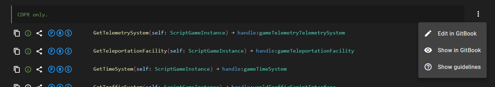

# Contributing

## Use GitBook

This space is used to write and store documentation. It will synchronize the data in a [GitHub repository](https://github.com/CDPR-Modding-Documentation/NativeDB-wiki/). NativeDB get the documentation from this repository to show it when browsing the codebase.


GitHub Api limits free access to 60 requests per hour. It doesn't require you to login with a GitHub account from NativeDB. It should be good enough for now.


If you never used GitBook before, you'll see that it is easy to use after learning some basics. [See this guide](https://app.gitbook.com/s/4gzcGtLrr90pVjAWVdTc/the-wiki) to find your way around.

NativeDB provides buttons to quickly open GitBook in the right place:

<figure><figcaption>
Showcase quick access to open documentation in GitBook from NativeDB.
</figcaption></figure>

## NativeDB and GitBook

NativeDB expects a custom format and structure to get the data from GitBook, and to show it as beautifully as possible. You first need to learn a few rules, you can start with [this guide](structure.md). It will also explain some guidelines on what to write or not when documenting.

Now that you made a change request, wrote some documentation, you can request a review. An administrator will check it, and if it is alright, merge your change request.

NativeDB will store the documentation in your browser as a cache. It helps improve performance and it reduces the usage of the network's bandwidth. It will only refresh the list of documented classes every 10 minutes (to see if there are changes to update locally). If NativeDB is already open, it will not show your last merged change request. You can wait up to 10 minutes or hit `F5` to refresh your tab.

Thank you for your contributions!


If you get lost,\
If you think a guide lack information,\
If you think a guide is not clear enough,\
If you have any other feedback to share,

Please do reach us on Discord in the [NativeDB@wiki](https://discord.com/channels/717692382849663036/1204386919727894548) channel.

