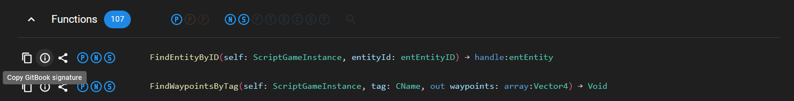

# Structure

One sub-page = one class

Sub-page of a class must be within page "CLASSES".

Order sub-pages alphabetically (from A to Z).


It is useful to quickly navigate between classes, like to browse / add new classes.


## Class

You have to follow a small set of rules to write documentation about a class. The format described below is required to show the documentation in NativeDB.


A minimal example shows you how it should look like with Markdown, at the [end of this guide](structure.md#minimal-example).


### Setup page

Option "Page description" must be turned off in "Page options". You can find the feature when moving your mouse over the title of the page.

Title of the page must be the native name of the class. You can configure code syntax in NativeDB with option `Pseudocode · Legacy` to only show native names.


**DO** write vehicleBaseObject



**DON'T** write VehicleObject


### Add a description

Add header "Description**"** using block "Heading 1".


**DO** write Description



**DON'T** write anything else, like descriptionS


After this header, you can add content (like a paragraph) to describe useful knowledge about the class. It will be visible like this in NativeDB:

<figure><figcaption><p>Showcase of a class description in NativeDB.</p></figcaption></figure>

### Add functions

Add header "Functions" using block "Heading 1", if it doesn't exist already. You can then add functions after this header, as described below.


**DO** write Functions



**DON'T** write anything else, like Methods


Add a function using block "Heading 3". This header must be the signature of the function using the `Pseudocode · Legacy` code syntax.


If the signature of the function is not valid, you're change request will not be merged.


You should use the feature provided by NativeDB to quickly copy the signature of a function in your clipboard. You can do so like this:

<figure><figcaption><p>Showcase NativeDB feature to copy the signature of a function for GitBook.</p></figcaption></figure>

As an example with the function `FindEntityById`, it will look like this in your clipboard, ready to paste in GitBook:

```
FindEntityByID(self: ScriptGameInstance, entityId: entEntityID) -&gt; handle:entEntity
```

Like with the description, you can then add content below the header of the function to describe it.


You don't have to write both sections (**Description** and **Functions**) when creating a new class. You need to at least add one of the two sections, be it **Description** or **Functions**.

When present, the section **Description** must be at the very top of the page.


#### Minimal example

```markdown
# gameweaponObject

## Description

Tell me what is not explicit about this object. It should be relevant information.
You can omit this section when you have nothing to say here.

## Functions

#### CanReload(self: handle:gameweaponObject) -&gt; Bool

This is an example of what you should NOT write documentation for. The signature
of the function and the name are already explicit about what this function does.

#### GetAttack(recordName: CName) -&gt; handle:gameIAttack

You can append functions one after the other, preferably in alphabetical order. In 
this case, it could be useful to list known values used by the argument `recordName`.
Or reference a place where the list is already available (maybe using WolvenKit) 
for example. If in WKit, you can indicate the path where to look for the data.
```

You're ready to go on with the next guide:
